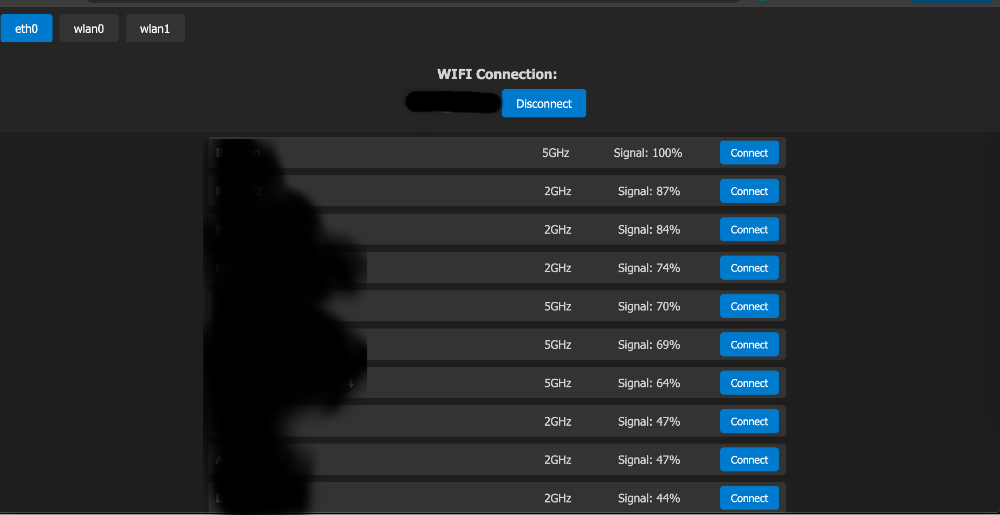
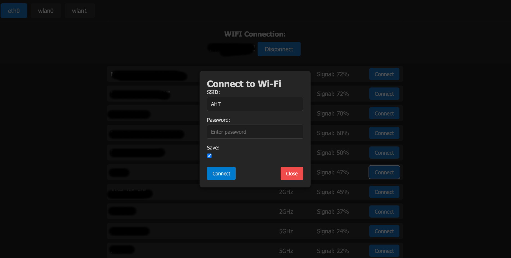

# Webnm 

Webnm is a cobbled together tool for managing Wi-Fi networks and switching the default route (switch-iface) for my Raspberry Pi workers. In my case, Raspberry Pi devices act as Wi-Fi access points with a USB modem, TUN, and other interfaces on board. When you're on the go with only a phone at hand, it’s really convenient to manage connections through the web UI. I wouldn't exactly call it a full-fledged project, but if you're interested in developing it further, you’re welcome!

I haven't considered Cockpit, as it doesn't fit my specific use case.

Inspired by an article:
[Host a Wi-Fi hotspot with a Raspberry Pi](https://www.raspberrypi.com/tutorials/host-a-hotel-wifi-hotspot/)

### Installation from source 
*!!! Install golang before building the project* [golang](https://go.dev/doc/install)

```bash
$ git clone https://github.com/mmadfox/rpi-wifi-web-manager.git
$ cd rpi-wifi-web-manager
$ make build
$ sudo mv ./build/linux-arm64-webnm /usr/local/bin/webnm
$ sudo cp ./scripts/webnm.service /etc/systemd/system/
$ sudo systemctl enable webnm.service
$ sudo systemctl start webnm.service
$ sudo systemctl status webnm.service
```
### Screenshots

